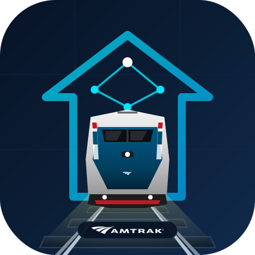

# Amtrak Tracker for Home Assistant

<p align="center">
  
</p>

[](https://github.com/hacs/integration)

A Home Assistant custom integration that tracks Amtrak trains between an origin station and a destination station on specific days and time ranges using the unofficial community-maintained [Amtraker API](https://amtraker.com).

## Features
- **Searchable Station Dropdowns:** Select origin and destination stations easily from the configuration UI.
- **Dynamic Scheduling:** Filter tracks by specific days of the week (e.g. only Monday and Wednesday) and a scheduled departure window (e.g. 08:00 to 12:00).
- **Timezone Awareness:** Calculates weekdays and time offsets relative to the origin station's local timezone.
- **Multi-Train Tracking:** Tracks up to 3 upcoming trains simultaneously for each configured route, creating both Train Time and Train Delay sensors for each.
- **Built-in Notifications & Live Activities:** Automatically sends push notifications for upcoming trains, supporting Home Assistant persistent notifications and mobile app push notifications with native iOS/Android Live Activity (chronometer) updates.
- **Estimated and Scheduled Delays:** Computes real-time delays at both departure (origin) and arrival (destination) stations in minutes.
- **Entity Attributes:** Exposes detailed train attributes including name, number, current coordinates, speed, and status.
- **Optimized Network Fetching:** Shares a single consolidated endpoint poll (`https://api.amtraker.com/v3/trains`) across all configured sensors via a `DataUpdateCoordinator` to respect API rate limits.

---

## Installation

### Via HACS (Recommended)
1. Open **HACS** in your Home Assistant UI.
2. Click the three dots in the top-right corner and select **Custom repositories**.
3. Paste the URL of this repository: `https://github.com/sahilanguralla/ha-amtrak-tracker`.
4. Select **Integration** as the Category and click **Add**.
5. Find **Amtrak Tracker** in the HACS list and click **Download**.
6. Restart Home Assistant.

### Manual Installation
1. Download the latest release from the GitHub Releases page.
2. Extract the contents and copy the `custom_components/amtrak_tracker` folder into your Home Assistant config's `custom_components/` directory.
3. Restart Home Assistant.

---

## Configuration

1. In Home Assistant, go to **Settings -> Devices & Services**.
2. Click **+ Add Integration** in the bottom right.
3. Search for **Amtrak Tracker** and select it.
4. Fill in the configuration details:
   - **Origin Station:** Choose your starting station (e.g. *New York Penn (NYP)*) from the searchable list.
   - **Destination Station:** Choose your destination station (e.g. *Philadelphia 30th Street (PHL)*) from the list.
   - **Days of the week:** Check the days you want to track.
   - **Start time:** The start of the scheduled departure time range (HH:MM, local time at origin).
   - **End time:** The end of the scheduled departure time range (HH:MM, local time at origin).
   - **Enable Notifications:** Check to enable automated upcoming train notifications.
   - **Notification Service:** Choose the target service/entity (e.g. `persistent_notification` or a mobile device app notify entity).
   - **Enable Live Activity:** Enable to send persistent, sticky updates with a ticking chronometer. When disabled, sends regular high-priority time-sensitive notifications.
5. Click **Submit**.

> [!NOTE]
> All settings (including days of the week, times, and notification settings) can be updated at any time by clicking **Configure** on the integration card under **Settings -> Devices & Services**.

---

## Sensor State & Attributes

Each configured tracker creates 6 sensor entities (3 Train Time sensors and 3 Train Delay sensors) to track up to 3 upcoming trains:

- **Train Time Sensors (`#1 Train Time`, `#2 Train Time`, `#3 Train Time`):**
  - **State:** The estimated departure time of the train (e.g. `9:05 AM`). If no train matches, the state will be `unknown`.
- **Train Delay Sensors (`#1 Train Delay`, `#2 Train Delay`, `#3 Train Delay`):**
  - **State:** The departure delay in minutes (e.g. `15`). If no train matches, the state will be `unknown`.
  - **Unit of Measurement:** `min`

### Attributes
Both types of sensors expose the following attributes for their respective scheduled/upcoming train:

| Attribute | Description |
| :--- | :--- |
| `origin_code` | Origin station code (e.g., `NYP`). |
| `origin_name` | Full name of origin station. |
| `destination_code` | Destination station code (e.g., `PHL`). |
| `destination_name` | Full name of destination station. |
| `train_number` | Active train number (e.g. `19`). |
| `route_name` | Route/Train name (e.g., `Crescent`). |
| `train_id` | Unofficial API train ID (e.g., `19-1`). |
| `train_state` | State of the train (e.g., `Active`, `Predeparture`, `Completed`). |
| `departure_status` | Status at origin (e.g., `Enroute`, `Station`, `Departed`). |
| `scheduled_departure` | Scheduled departure timestamp. |
| `estimated_departure` | Estimated/actual departure timestamp. |
| `delay_departure_minutes` | Departure delay in minutes (positive values represent delays). |
| `scheduled_arrival` | Scheduled arrival timestamp. |
| `estimated_arrival` | Estimated/actual arrival timestamp. |
| `delay_arrival_minutes` | Arrival delay at destination in minutes. |
| `train_latitude` | Latitude coordinate of the train's current position. |
| `train_longitude` | Longitude coordinate of the train's current position. |
| `train_speed_mph` | Current speed of the train in miles per hour. |
| `matched_trains_count` | Total matching runs scheduled for the configured day. |
| `upcoming_trains_count` | Count of matching runs that have not yet departed. |

---

## Built-in Notifications & Live Activities

The integration includes a built-in notification manager that automatically sends notifications when upcoming trains have updates, delays, or schedule changes.

### Configuration
- **Enable Notifications:** Toggles the notification system. If enabled, the integration tracks the next upcoming train and sends alerts.
- **Notification Target:** Choose where notifications are sent. Options include:
  - `Persistent Notification` (built-in Home Assistant notifications).
  - Any registered `notify` platform entity or legacy service (e.g., `notify.mobile_app_your_iphone`).
- **Enable Live Activity:** When sending to a mobile device app (e.g. Companion App):
  - **Enabled (Live Activity):** Delivers a persistent, sticky notification featuring a ticking chronometer (using the train's estimated departure timestamp) and real-time status updates (delays, arrival status).
  - **Disabled (High Priority):** Sends regular, time-sensitive high-priority push notifications to the device.

---

## Example Automation

While the integration has built-in notifications, you can also build custom Home Assistant automations using the sensors. This automation sends a notification to your mobile app if the next upcoming train (#1) is delayed by more than 10 minutes.

```yaml
alias: "Notify on Amtrak Train Delay"
trigger:
  - platform: numeric_state
    entity_id: sensor.new_york_penn_station_to_philadelphia_30th_street_amtrak_tracker_1_train_delay
    above: 10
condition:
  # Ensure there is an active train selected
  - condition: template
    value_template: "{{ state_attr('sensor.new_york_penn_station_to_philadelphia_30th_street_amtrak_tracker_1_train_delay', 'train_number') != None }}"
action:
  - service: notify.mobile_app_your_phone
    data:
      title: "Amtrak Train Delayed"
      message: >
        Amtrak {{ state_attr('sensor.new_york_penn_station_to_philadelphia_30th_street_amtrak_tracker_1_train_delay', 'route_name') }} (Train {{ state_attr('sensor.new_york_penn_station_to_philadelphia_30th_street_amtrak_tracker_1_train_delay', 'train_number') }}) is departing {{ state_attr('sensor.new_york_penn_station_to_philadelphia_30th_street_amtrak_tracker_1_train_delay', 'origin_name') }} delayed by {{ states('sensor.new_york_penn_station_to_philadelphia_30th_street_amtrak_tracker_1_train_delay') }} minutes. Estimated departure: {{ state_attr('sensor.new_york_penn_station_to_philadelphia_30th_street_amtrak_tracker_1_train_delay', 'estimated_departure') }}.
```

---

## API Attribution & Disclaimer
This project is an unofficial integration and is not endorsed by or affiliated with Amtrak. Data is retrieved using the [Amtraker API](https://amtraker.com) v3 developed by Piero Maddaleni. Please use responsibly and respect rate limits.
